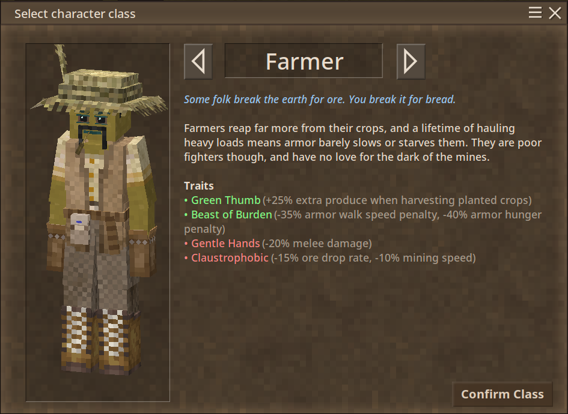

# Farmer Class

A small, standalone Vintage Story mod that adds a single farmer character class.



## Build

```sh
./build.sh
VS_DIR=/path/to/vs ./build.sh
```

Produces `dist/farmerclass_<version>.zip`

## Credits

Crop-yield patches (`produceDropRate`) adapted from [The Working Classes](https://mods.vintagestory.at/theworkingclasses) by Vivi_IX.
